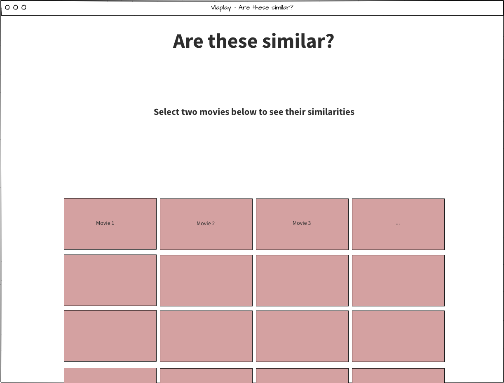
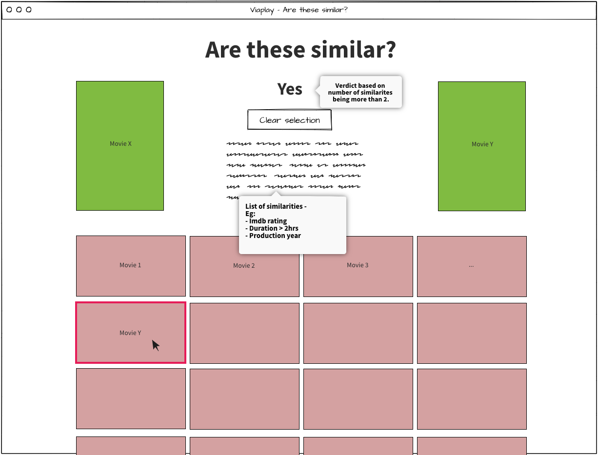

# Viaplay - Are these similar? - Instructions

### Hello there!

Thank you for applying to Viaplay and taking the time to do the home test. Please read through the following instructions carefully before starting your work.

## Getting started

This test is designed to test your skills in building web interfaces using a **JS frontend framework** of your choice. You'll see that we have the starter project for React setup already since that is the framework we use the most at Viaplay. But if you feel that you would rather use a different framework for the test, you are free to do it. You will find instructions on setting up the project with the framework you choose [below](#setting-up-the-project-with-a-different-framework).

1. Pick your framework's folder. You'll be doing all your work in there and _just submitting the contents of that folder_ once you are done.
2. Initialize a git repository in the folder.
3. Commit [your tasks](#your-tasks) as you please.
4. Push your work to github/gitlab or any other git hosting service where you can share it with us.
5. Edit the README in the folder and add instructions on how to run the project and any other documentation that you think might be relevant.
6. Send us the link to your repo.

## Your tasks

In your project folder, you'll find a module `/src/api/content.js` which has a default export that returns a promise that resolves to a list of movies from Viaplay. You'll be working with this as the data source in your app.

1. Use the content service to list all movies in the form of a grid.
2. Allow the user to select two (2) movies from the grid for comparison. Display the selected movies prominently on top using the image template from the content service.
3. Add a reset button to clear selections.
4. Indicate to the user if the selected movies are similar by comparing these two (2) properties:
   - `production.year`
   - `parentalRating`
5. Movies are now considered similar if they share three (3) or more properties, extend comparison to the following properties:

   - `imdb.rating` (rounded to the nearest integer)
   - `people.actors` (at least one actor in common)
   - `duration` (duration within one of these groups):
     - `x < 1 hr` (under an hour)
     - `1 hr ≤ x < 2 hrs` (From 1 hour, but less than 2)
     - `x ≥ 2 hrs` (2 hours or longer)

Do not spend more than a few of hours on this assignment. Keep it simple!

## Sample wireframes

**Default state**

**When movies are selected**

### Setting up the project with a different framework

1. Create a starter project with the framework of your choice.
2. Copy the contents of `similar-react/src/api` into your project's `/src/api` folder (folder structure is only a suggestion).
3. Import the default export from the copied `content.js` in any place you want to fetch data.
4. That's it!
